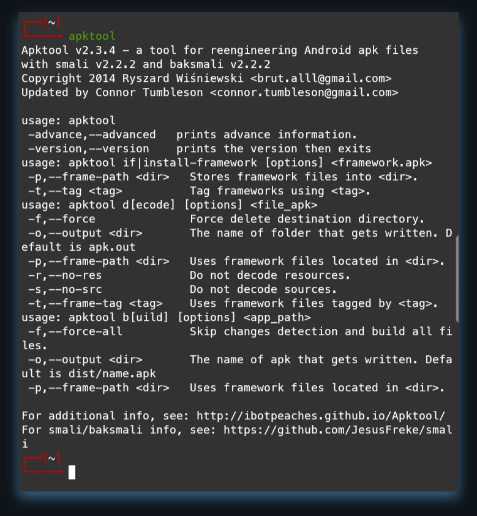

<H1 align="center">
APKTOOL FOR TERMUX
</H1>
<p align="center">
<a href="https://github.com/AN74NK"></a>
</br>
<a href="https://instagram.com/an74nk_"></a>
</p>

<p align="center">
Coded by <a href="https://instagram.com/an74nk_">an74nk</a>
</p>

# Screenshot


# Installing
```
$ apt install git
$ git clone https://github.com/AN74NK/apktool_termux
$ cd apktool_termux
$ bash setup
```

